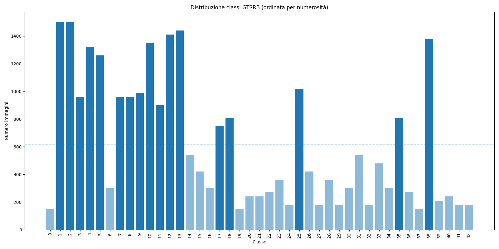
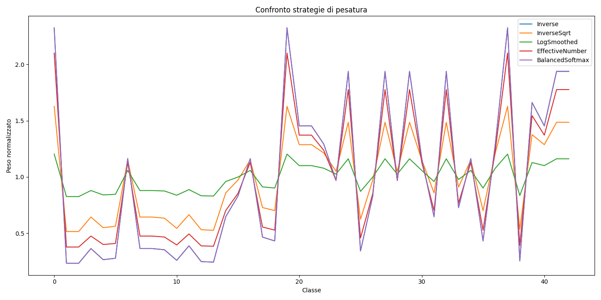

# 🛑 German Traffic Sign Recognition (GTSRB)

Traffic sign classification project focused on exploring CNNs and PyTorch pipelines for the GTSRB dataset.

The repository is structured for experimentation, modularity, and reproducibility.

## 🗝️ Features

- **Multi-Class Classification**: 43 types of road signs.
- **Custom Architectures**:
  - *TakeThat* – lightweight LeNet-style CNN
  - *SpandauBallet* – medium-depth CNN with BatchNorm & Dropout
  - *Queen* – deep CNN with Global Average Pooling
- **Pretrained Models**: Fine-tuning with ResNet18 (ImageNet weights) ready.
- **Data Handling**:
  - *Preprocessing with ROI cropping* and normalization
  - *Data augmentation* (configurable)
  - *Weighted loss strategies* (log-smoothed, inverse sqrt, etc.)
- **Evaluation**: Accuracy, Precision, Confusion Matrix

## 📊 Dataset Analysis

- **Total images**: 26,640
- **Class distribution**: unbalanced, ratio ~1:10
- **Analysis tools**: matplotlib, Counter

### Class Distribution

### Weight Strategies for Loss

Log-smoothed and inverse-sqrt weights identified as most balanced for training.

## 📊 Performance Highlights

_Works in progress_

## 🖼️ Visual Results

_Works in progress_

## 📂 Project Structure

- **models/**: CNN architectures and pretrained model wrappers
- **utils/**: Training, evaluation, metrics, early stopping, etc.
- **networks/**: Trained CNNs (.pth files)
- **dataset.py**: PyTorch Dataset & DataLoader logic
- **resnet18.py**: Training script for ResNet18 fine-tuning
- **simple.py**: Training script for custom CNNs
- **README.md**
- **requirements.txt**

## 🔜 Next Steps

- Train all custom CNNs and ResNet18
- Experiment with different data augmentations and weight strategies
- Compare results: accuracy, precision, confusion matrix, and per-class metrics

## 🔚 References

Dataset: [GTSRB](https://benchmark.ini.rub.de/ "Dataset")

PyTorch: [Documentation](https://docs.pytorch.org/docs/stable/index.html "Pytorch doc")

